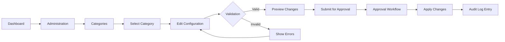
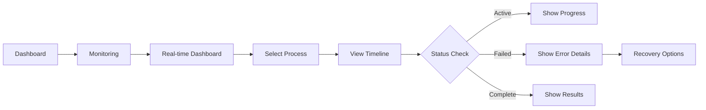
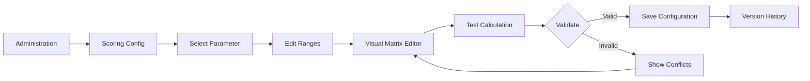

# Front-End Specification: CognitoAI-Engine Admin & Monitoring Dashboard
## Epic 7 - Administrative & Monitoring Interfaces

---

## 1. PROJECT OVERVIEW

### Product Name
**CognitoAI-Engine Administrative Dashboard**

### Purpose
Comprehensive web-based administrative and monitoring interface for pharmaceutical organizations to manage CognitoAI-Engine operations while maintaining complete regulatory transparency and audit compliance.

### Target Users
- **System Administrators** - Full system configuration and management
- **Operations Managers** - Real-time monitoring and performance tracking
- **Compliance Officers** - Audit trail review and regulatory reporting
- **Business Analysts** - Performance analytics and optimization

### Platform Requirements
- **Primary**: Modern web browsers (Chrome 90+, Firefox 88+, Safari 14+, Edge 90+)
- **Responsive Design**: Desktop (1920x1080), Tablet (768x1024), Mobile (375x812)
- **Accessibility**: WCAG 2.1 Level AA compliance
- **Performance**: Initial load < 3s, Interaction response < 100ms

---

## 2. DESIGN SYSTEM

### Brand Guidelines

#### Color Palette (Light & Dark Mode Support)
```css
/* CSS Variables for Theme Switching */
:root[data-theme="light"] {
  /* Primary Colors */
  --primary-blue: #0066CC;      /* Main brand color */
  --primary-dark: #004499;      /* Hover/Active states */
  --primary-light: #E6F2FF;     /* Backgrounds */

  /* Status Colors */
  --success-green: #28A745;     /* Success, GO decisions */
  --warning-yellow: #FFC107;    /* Warnings, Conditional */
  --danger-red: #DC3545;        /* Errors, NO-GO decisions */
  --info-cyan: #17A2B8;         /* Information */

  /* Neutral Colors */
  --gray-900: #212529;           /* Primary text */
  --gray-700: #495057;           /* Secondary text */
  --gray-500: #6C757D;           /* Muted text */
  --gray-300: #DEE2E6;           /* Borders */
  --gray-100: #F8F9FA;           /* Backgrounds */
  --white: #FFFFFF;              /* Cards, modals */

  /* Semantic Colors */
  --bg-primary: #FFFFFF;         /* Main background */
  --bg-secondary: #F8F9FA;       /* Section backgrounds */
  --bg-tertiary: #E9ECEF;        /* Hover states */
  --text-primary: #212529;       /* Main text */
  --text-secondary: #495057;     /* Secondary text */
  --text-muted: #6C757D;         /* Muted text */
  --border-color: #DEE2E6;       /* Borders */
  --shadow: rgba(0, 0, 0, 0.1);  /* Shadows */
}

:root[data-theme="dark"] {
  /* Primary Colors */
  --primary-blue: #4D94FF;      /* Brighter for dark mode */
  --primary-dark: #0066CC;      /* Less contrast needed */
  --primary-light: #002244;     /* Dark backgrounds */

  /* Status Colors (adjusted for dark mode) */
  --success-green: #5CB85C;     /* Softer green */
  --warning-yellow: #FFD666;    /* Less harsh yellow */
  --danger-red: #FF6B6B;        /* Softer red */
  --info-cyan: #5BC0DE;         /* Lighter cyan */

  /* Neutral Colors (inverted) */
  --gray-900: #F8F9FA;           /* Primary text (light) */
  --gray-700: #DEE2E6;           /* Secondary text */
  --gray-500: #ADB5BD;           /* Muted text */
  --gray-300: #495057;           /* Borders */
  --gray-100: #212529;           /* Backgrounds (dark) */
  --white: #1A1D23;              /* Cards, modals (dark) */

  /* Semantic Colors */
  --bg-primary: #0D0F14;         /* Main background */
  --bg-secondary: #1A1D23;       /* Section backgrounds */
  --bg-tertiary: #25282F;        /* Hover states */
  --text-primary: #F8F9FA;       /* Main text */
  --text-secondary: #DEE2E6;     /* Secondary text */
  --text-muted: #ADB5BD;         /* Muted text */
  --border-color: #2D3139;       /* Borders */
  --shadow: rgba(0, 0, 0, 0.5);  /* Deeper shadows */
}

/* Automatic theme detection */
@media (prefers-color-scheme: dark) {
  :root:not([data-theme="light"]) {
    /* Apply dark theme by default if user prefers dark */
  }
}
```

#### Typography
```css
/* Font Stack */
--font-primary: 'Inter', -apple-system, BlinkMacSystemFont, 'Segoe UI', sans-serif;
--font-mono: 'JetBrains Mono', 'Consolas', monospace;

/* Type Scale */
--text-xs: 0.75rem;    /* 12px - Labels, captions */
--text-sm: 0.875rem;   /* 14px - Secondary text */
--text-base: 1rem;     /* 16px - Body text */
--text-lg: 1.125rem;   /* 18px - Emphasis */
--text-xl: 1.25rem;    /* 20px - Section headers */
--text-2xl: 1.5rem;    /* 24px - Page headers */
--text-3xl: 2rem;      /* 32px - Dashboard titles */

/* Font Weights */
--font-normal: 400;
--font-medium: 500;
--font-semibold: 600;
--font-bold: 700;
```

#### Spacing System
```css
/* Spacing Scale (8px base) */
--space-1: 0.25rem;   /* 4px */
--space-2: 0.5rem;    /* 8px */
--space-3: 0.75rem;   /* 12px */
--space-4: 1rem;      /* 16px */
--space-5: 1.25rem;   /* 20px */
--space-6: 1.5rem;    /* 24px */
--space-8: 2rem;      /* 32px */
--space-10: 2.5rem;   /* 40px */
--space-12: 3rem;     /* 48px */
--space-16: 4rem;     /* 64px */
```

### Component Library

#### Navigation Components
- **Top Navigation Bar** - Global app navigation with user menu
- **Side Navigation** - Section navigation with collapsible groups
- **Breadcrumbs** - Location context and navigation
- **Tab Navigation** - Content switching within pages

#### Data Display Components
- **Data Tables** - Sortable, filterable, paginated tables
- **Cards** - Content containers with headers and actions
- **Charts** - Line, bar, pie, gauge, heatmap visualizations
- **Timeline** - Process flow visualization
- **Metrics Cards** - KPI display with trends
- **Status Badges** - Visual status indicators

#### Form Components
- **Input Fields** - Text, number, date, select, multi-select
- **Toggle Switches** - Boolean settings
- **Radio Groups** - Single selection options
- **Checkboxes** - Multiple selection options
- **Sliders** - Range selection
- **File Upload** - Drag-and-drop file handling
- **Rich Text Editor** - Template and documentation editing

#### Feedback Components
- **Toast Notifications** - Success/error/warning messages
- **Modals** - Confirmation dialogs, forms
- **Loading States** - Spinners, skeletons, progress bars
- **Empty States** - No data illustrations and CTAs
- **Error States** - Error boundaries and recovery options

---

## 3. INFORMATION ARCHITECTURE

### Site Map

```
Dashboard (/)
├── Overview
│   ├── System Health
│   ├── Active Processes
│   └── Recent Activity
│
├── Administration (/admin)
│   ├── Categories (/admin/categories)
│   │   ├── List View
│   │   ├── Configuration Editor
│   │   └── Template Manager
│   │
│   ├── APIs (/admin/apis)
│   │   ├── Service Configuration
│   │   ├── Cost Tracking
│   │   └── Quota Management
│   │
│   ├── Users (/admin/users)
│   │   ├── User List
│   │   ├── Roles & Permissions
│   │   └── Organization Hierarchy
│   │
│   ├── Scoring (/admin/scoring)
│   │   ├── Parameter Configuration
│   │   ├── Range Editor
│   │   ├── Import/Export
│   │   └── Version History
│   │
│   └── System (/admin/system)
│       ├── Configuration Backup
│       ├── Approval Workflows
│       └── Audit Logs
│
├── Monitoring (/monitoring)
│   ├── Real-time Dashboard
│   ├── Process Timeline
│   ├── Performance Metrics
│   ├── Queue Status
│   └── Resource Utilization
│
├── Analytics (/analytics)
│   ├── Performance Trends
│   ├── Success Rates
│   ├── Processing Times
│   └── Custom Reports
│
└── Help (/help)
    ├── Documentation
    ├── API Reference
    └── Support
```

### Navigation Structure

#### Primary Navigation (Top Bar)
1. **Logo/Home** - Return to dashboard
2. **Dashboard** - System overview
3. **Administration** - Configuration management
4. **Monitoring** - Real-time operations
5. **Analytics** - Historical analysis
6. **User Menu** - Profile, settings, logout

#### Secondary Navigation (Side Bar)
- Context-specific based on selected primary section
- Collapsible groups for sub-sections
- Quick actions for common tasks

---

## 4. USER FLOWS

### Flow 1: Configure Category Parameters



### Flow 2: Monitor Active Process



### Flow 3: Configure Technology Scoring



---

## 5. WIREFRAMES & MOCKUPS

### Dashboard Overview
```
┌────────────────────────────────────────────────────────────┐
│ [Logo] CognitoAI    Dashboard  Admin  Monitor  Analytics   │
│                                              [User] [Menu] │
├────────────────────────────────────────────────────────────┤
│                                                            │
│  System Health                     Active Processes       │
│  ┌──────────────┐                 ┌──────────────┐      │
│  │ ● Operational │                 │   15 Active  │      │
│  │   All Systems │                 │    3 Queued  │      │
│  │   99.9% Up    │                 │    2 Failed  │      │
│  └──────────────┘                 └──────────────┘      │
│                                                          │
│  Recent Activity                                         │
│  ┌────────────────────────────────────────────────┐    │
│  │ Time     Request    Category   Status   Action │    │
│  │ 10:23   REQ-001    Cardio     Success   View  │    │
│  │ 10:21   REQ-002    Onco       Active    View  │    │
│  │ 10:19   REQ-003    Neuro      Failed    View  │    │
│  └────────────────────────────────────────────────┘    │
│                                                          │
│  Performance Metrics                                     │
│  ┌────────────────────────────────────────────────┐    │
│  │     [Chart: Processing Time Trend]             │    │
│  │     [Chart: Success Rate]                      │    │
│  └────────────────────────────────────────────────┘    │
└────────────────────────────────────────────────────────────┘
```

### Category Configuration Interface
```
┌────────────────────────────────────────────────────────────┐
│ Administration > Categories > Cardiovascular              │
├────────────────────────────────────────────────────────────┤
│ ┌─────────────┬──────────────────────────────────────┐   │
│ │ Categories  │  Cardiovascular Configuration        │   │
│ │             │                                      │   │
│ │ ▼ Clinical  │  [Enable] Active                    │   │
│ │   Cardio ●  │                                     │   │
│ │   Onco      │  Template                           │   │
│ │   Neuro     │  ┌─────────────────────────────┐   │   │
│ │             │  │ {{drug_name}} Analysis       │   │   │
│ │ ▼ Research  │  │ Category: {{category}}       │   │   │
│ │   Phase I   │  │ Sources: {{sources}}         │   │   │
│ │   Phase II  │  └─────────────────────────────┘   │   │
│ │             │                                     │   │
│ │             │  Parameters                        │   │
│ │             │  ┌─────────────────────────────┐   │   │
│ │             │  │ Name         Type    Required│   │   │
│ │             │  │ drug_name    text    ✓       │   │   │
│ │             │  │ indication   select  ✓       │   │   │
│ │             │  │ dosage       number  □       │   │   │
│ │             │  └─────────────────────────────┘   │   │
│ │             │                                     │   │
│ │             │  [Save Changes] [Preview] [Cancel] │   │
│ └─────────────┴──────────────────────────────────────┘   │
└────────────────────────────────────────────────────────────┘
```

### Real-time Monitoring Dashboard
```
┌────────────────────────────────────────────────────────────┐
│ Monitoring > Real-time Dashboard                          │
├────────────────────────────────────────────────────────────┤
│                                                            │
│  Active Requests                         Auto-refresh [5s]│
│  ┌────────────────────────────────────────────────────┐  │
│  │ REQ-001 │████████░░│ 80% │ Cardio  │ Processing   │  │
│  │ REQ-002 │███░░░░░░░│ 30% │ Onco    │ Analyzing    │  │
│  │ REQ-003 │██████████│100% │ Neuro   │ Complete     │  │
│  └────────────────────────────────────────────────────┘  │
│                                                            │
│  Process Timeline - REQ-001                              │
│  ┌────────────────────────────────────────────────────┐  │
│  │ Intake → Extract → Verify → Process → Decision     │  │
│  │   ✓        ✓         ✓        ●          ○         │  │
│  │  2min     5min      3min     Active     Pending    │  │
│  └────────────────────────────────────────────────────┘  │
│                                                            │
│  System Resources                                         │
│  ┌──────────────┬──────────────┬──────────────┐        │
│  │ CPU: 45%     │ Memory: 62%  │ Queue: 15    │        │
│  │ ████░░░░░░  │ ██████░░░░  │ Avg: 2.5min  │        │
│  └──────────────┴──────────────┴──────────────┘        │
│                                                            │
│  Alerts                                                   │
│  ⚠ High queue depth detected (>10 requests)             │
│  ⚠ API rate limit approaching for Source A              │
└────────────────────────────────────────────────────────────┘
```

### Technology Scoring Configuration
```
┌────────────────────────────────────────────────────────────┐
│ Administration > Scoring > Technology Scoring Matrix      │
├────────────────────────────────────────────────────────────┤
│ Delivery Method: [Transdermal ▼]  Parameter: [Dose ▼]    │
│                                                            │
│ Visual Range Editor                                       │
│ ┌────────────────────────────────────────────────────┐   │
│ │     0    10    25    50    100    200    >200     │   │
│ │  ┌────┬─────┬─────┬──────┬───────┬──────┬────┐   │   │
│ │  │ 5  │  4  │  3  │  2   │   1   │  0   │ X  │   │   │
│ │  └────┴─────┴─────┴──────┴───────┴──────┴────┘   │   │
│ │   Exc  Good  Fair  Poor  V.Poor  Fail  Excl      │   │
│ └────────────────────────────────────────────────────┘   │
│                                                            │
│ Scoring Ranges                                           │
│ ┌────────────────────────────────────────────────────┐   │
│ │ Score │ Min  │ Max  │ Label      │ Exclusion     │   │
│ │   5   │  0   │  10  │ Excellent  │      □        │   │
│ │   4   │  10  │  25  │ Good       │      □        │   │
│ │   3   │  25  │  50  │ Fair       │      □        │   │
│ │   2   │  50  │ 100  │ Poor       │      □        │   │
│ │   1   │ 100  │ 200  │ Very Poor  │      □        │   │
│ │   0   │ 200  │  -   │ Exclusion  │      ✓        │   │
│ └────────────────────────────────────────────────────┘   │
│                                                            │
│ Test Calculation                                         │
│ ┌────────────────────────────────────────────────────┐   │
│ │ Dose: [15] MW: [250] MP: [120] LogP: [2.5]        │   │
│ │ [Calculate]                                         │   │
│ │                                                      │   │
│ │ Result: Score 82/100 - GO                          │   │
│ └────────────────────────────────────────────────────┘   │
│                                                            │
│ [Save Configuration] [Export CSV] [Version History]      │
└────────────────────────────────────────────────────────────┘
```

---

## 6. INTERACTION PATTERNS

### Data Table Interactions
- **Sorting**: Click column headers to sort (asc/desc/none)
- **Filtering**: Inline filters per column with type-appropriate inputs
- **Pagination**: Page size selector (10/25/50/100), page navigation
- **Selection**: Row checkboxes for bulk actions
- **Actions**: Row-level action buttons (View, Edit, Delete)
- **Export**: Download as CSV/Excel/PDF

### Form Interactions
- **Validation**: Real-time field validation with error messages
- **Auto-save**: Draft saving every 30 seconds
- **Confirmation**: Modal dialogs for destructive actions
- **Progress**: Multi-step forms with progress indicators
- **Help**: Contextual tooltips and help text

### Dashboard Interactions
- **Auto-refresh**: Configurable refresh intervals (5s/10s/30s/1m)
- **Drag-and-drop**: Rearrangeable dashboard widgets
- **Drill-down**: Click metrics to see detailed views
- **Time range**: Date/time pickers for historical data
- **Filters**: Global filters affecting all dashboard widgets

### Notification Patterns
- **Toast**: Temporary success/error messages (5s auto-dismiss)
- **Banners**: Persistent system-wide announcements
- **Badges**: Unread counts on navigation items
- **Modals**: Critical alerts requiring acknowledgment
- **Sound**: Optional audio alerts for critical events

---

## 7. RESPONSIVE DESIGN

### Breakpoints
```css
/* Mobile First Approach */
--breakpoint-sm: 640px;   /* Large phones */
--breakpoint-md: 768px;   /* Tablets */
--breakpoint-lg: 1024px;  /* Small laptops */
--breakpoint-xl: 1280px;  /* Desktops */
--breakpoint-2xl: 1536px; /* Large screens */
```

### Mobile Adaptations
- **Navigation**: Hamburger menu with full-screen overlay
- **Tables**: Horizontal scroll with fixed first column
- **Charts**: Simplified views with touch interactions
- **Forms**: Full-width inputs with larger touch targets
- **Dashboard**: Single column layout with collapsible sections

### Tablet Adaptations
- **Navigation**: Collapsible sidebar
- **Tables**: Show primary columns, expand for details
- **Charts**: Touch-optimized with gesture support
- **Forms**: Two-column layout where appropriate
- **Dashboard**: 2-column grid layout

### Desktop Features
- **Navigation**: Always visible sidebar
- **Tables**: All columns visible, inline editing
- **Charts**: Full interactive features, hover details
- **Forms**: Multi-column layouts, side-by-side comparisons
- **Dashboard**: Flexible grid layout, multiple widgets visible

---

## 8. ACCESSIBILITY

### WCAG 2.1 Compliance

#### Perceivable
- **Color Contrast**: Minimum 4.5:1 for normal text, 3:1 for large text
- **Alt Text**: Descriptive alt text for all images and icons
- **Captions**: Video captions and audio transcripts
- **Color Independence**: Information not conveyed by color alone

#### Operable
- **Keyboard Navigation**: Full keyboard accessibility
- **Focus Indicators**: Visible focus states for all interactive elements
- **Skip Links**: Skip to main content option
- **Time Limits**: User control over time-dependent content

#### Understandable
- **Labels**: Clear, descriptive labels for all form inputs
- **Error Messages**: Specific error descriptions and recovery suggestions
- **Consistent Navigation**: Same navigation structure throughout
- **Language**: Plain language, medical terms explained

#### Robust
- **Semantic HTML**: Proper HTML5 semantic elements
- **ARIA Labels**: Appropriate ARIA attributes where needed
- **Screen Reader**: Full compatibility with JAWS, NVDA, VoiceOver
- **Browser Support**: Progressive enhancement approach

---

## 9. PERFORMANCE

### Loading Performance
- **Initial Load**: < 3 seconds on 3G connection
- **Time to Interactive**: < 5 seconds
- **First Contentful Paint**: < 1.5 seconds
- **Code Splitting**: Route-based lazy loading
- **Asset Optimization**: WebP images, minified CSS/JS

### Runtime Performance
- **Interaction Response**: < 100ms for user actions
- **Animation**: 60fps for all animations
- **Data Updates**: Debounced API calls, optimistic updates
- **Memory Management**: Cleanup of event listeners and timers
- **Virtual Scrolling**: For large data sets (>1000 rows)

### Caching Strategy
- **Static Assets**: Browser cache with versioning
- **API Responses**: 5-minute cache for non-critical data
- **Offline Support**: Service worker for basic offline functionality
- **Local Storage**: User preferences and draft data

---

## 10. TECHNOLOGY STACK

### Frontend Framework
```javascript
// React 18+ with TypeScript
{
  "framework": "React 18.2",
  "language": "TypeScript 5.0",
  "bundler": "Vite 4.0",
  "styling": "Tailwind CSS 3.3",
  "state": "Redux Toolkit + RTK Query",
  "routing": "React Router 6.0",
  "forms": "React Hook Form + Zod",
  "charts": "Recharts 2.5",
  "tables": "TanStack Table 8.0",
  "testing": "Vitest + React Testing Library"
}
```

### Component Architecture
```typescript
// Example component structure
interface DashboardProps {
  userId: string;
  role: UserRole;
  preferences: UserPreferences;
}

const Dashboard: React.FC<DashboardProps> = ({ userId, role, preferences }) => {
  // Component implementation
  return (
    <DashboardLayout>
      <SystemHealth />
      <ActiveProcesses />
      <RecentActivity />
      <PerformanceMetrics />
    </DashboardLayout>
  );
};
```

### State Management
```typescript
// Redux Toolkit slice example
const adminSlice = createSlice({
  name: 'admin',
  initialState: {
    categories: [],
    users: [],
    configurations: {},
    loading: false,
    error: null
  },
  reducers: {
    // Reducer logic
  }
});
```

### API Integration
```typescript
// RTK Query API definition
const apiSlice = createApi({
  baseQuery: fetchBaseQuery({
    baseUrl: '/api',
    prepareHeaders: (headers, { getState }) => {
      const token = getState().auth.token;
      if (token) headers.set('authorization', `Bearer ${token}`);
      return headers;
    }
  }),
  endpoints: (builder) => ({
    getCategories: builder.query({
      query: () => '/categories'
    }),
    updateCategory: builder.mutation({
      query: ({ id, ...patch }) => ({
        url: `/categories/${id}`,
        method: 'PATCH',
        body: patch
      })
    })
  })
});
```

---

## 11. IMPLEMENTATION PHASES

### Phase 1: Foundation (Weeks 1-2)
- Setup development environment
- Implement design system and component library
- Create authentication and routing
- Build layout components (navigation, header, sidebar)

### Phase 2: Administration (Weeks 3-4)
- Category configuration interface
- User management system
- API configuration management
- Basic audit logging

### Phase 3: Monitoring (Weeks 5-6)
- Real-time dashboard
- Process timeline visualization
- Queue monitoring
- Alert system implementation

### Phase 4: Analytics & Scoring (Weeks 7-8)
- Performance metrics and charts
- Historical analysis tools
- Technology scoring configuration
- Import/export functionality

### Phase 5: Polish & Testing (Weeks 9-10)
- Responsive design refinement
- Accessibility audit and fixes
- Performance optimization
- End-to-end testing
- User acceptance testing

---

## 12. SUCCESS METRICS

### User Experience Metrics
- **Task Completion Rate**: > 95% for key workflows
- **Error Rate**: < 2% for form submissions
- **Time on Task**: < 3 minutes for configuration changes
- **User Satisfaction**: > 4.5/5 rating

### Performance Metrics
- **Page Load Time**: < 3 seconds for 95th percentile
- **API Response Time**: < 500ms for 95th percentile
- **Uptime**: 99.9% availability
- **Error Rate**: < 0.1% of requests

### Business Metrics
- **Adoption Rate**: 80% of users actively using dashboard
- **Configuration Efficiency**: 50% reduction in setup time
- **Issue Resolution Time**: 30% faster problem identification
- **Compliance Rate**: 100% audit trail coverage

---

## 13. RISKS & MITIGATIONS

### Technical Risks
- **Risk**: Complex real-time data synchronization
  - **Mitigation**: Implement WebSocket fallback to polling, use optimistic updates

- **Risk**: Large data set performance issues
  - **Mitigation**: Virtual scrolling, pagination, server-side filtering

- **Risk**: Browser compatibility issues
  - **Mitigation**: Progressive enhancement, polyfills, graceful degradation

### UX Risks
- **Risk**: Steep learning curve for complex features
  - **Mitigation**: Progressive disclosure, guided tours, comprehensive help

- **Risk**: Information overload on dashboards
  - **Mitigation**: Customizable widgets, role-based defaults, focus modes

### Security Risks
- **Risk**: Unauthorized access to sensitive configuration
  - **Mitigation**: Role-based access control, audit logging, encryption

---

## APPENDICES

### A. Glossary
- **Category**: Pharmaceutical analysis type (e.g., Cardiovascular, Oncology)
- **Template**: Configurable prompt template for AI processing
- **Parameter**: Variable input field for category configuration
- **Scoring Matrix**: Weighted evaluation system for Go/No-Go decisions
- **Audit Trail**: Complete record of all system changes for compliance

### B. References
- [WCAG 2.1 Guidelines](https://www.w3.org/WAI/WCAG21/quickref/)
- [React Documentation](https://react.dev/)
- [Tailwind CSS Documentation](https://tailwindcss.com/docs)
- [FDA 21 CFR Part 11 Compliance](https://www.fda.gov/regulatory-information/)

### C. Component Inventory
Available in design system at: `/design-system/components`

### D. API Documentation
Full API specification at: `/api/docs`

---

*Document Version: 1.0*
*Last Updated: 2025-09-27*
*Author: Sally - UX Expert*
*Status: Complete*